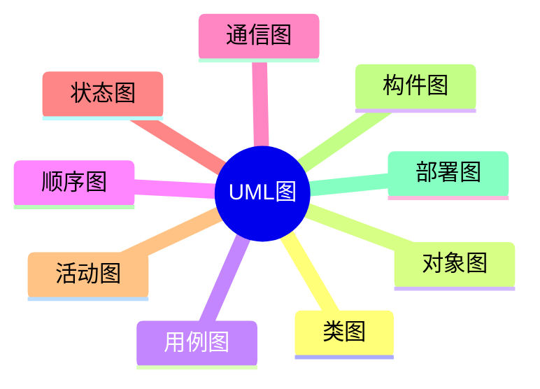

# 第五节 UML 图

> 本节依据第十一章课件中的 UML 图内容整理。

---

# 目录

1. UML 图概述
2. 类图（Class Diagram）
3. 对象图（Object Diagram）
4. 用例图（Use Case Diagram）
5. 顺序图（Sequence Diagram）
6. 通信图（Communication Diagram）
7. 状态图（State Diagram）
8. 活动图（Activity Diagram）
9. 构件图（Component Diagram）
10. 部署图（Deployment Diagram）
11. 常见 UML 图对比
12. 高频考点
13. 易错点
14. Mermaid 思维导图
15. 本节小结

---

# 1. UML 图概述

课程资料介绍了 UML 中常见的结构图和行为图，用于描述系统静态结构、动态行为以及系统部署等内容，是面向对象分析与设计的重要工具。

---

# 2. 类图（Class Diagram）

用于描述系统中的类、属性、方法及类之间的关系，是最常见的 UML 图。

---

# 3. 对象图（Object Diagram）

描述系统在某一时刻对象之间的实例关系，可看作类图的实例。

---

# 4. 用例图（Use Case Diagram）

描述参与者（Actor）与系统功能（Use Case）之间的关系，用于表达系统功能需求。

---

# 5. 顺序图（Sequence Diagram）

按照时间顺序描述对象之间消息传递过程，强调交互时序。

---

# 6. 通信图（Communication Diagram）

描述对象之间的协作关系，强调对象间连接关系及消息传递。

---

# 7. 状态图（State Diagram）

描述对象生命周期中的状态变化及状态转换。

---

# 8. 活动图（Activity Diagram）

描述业务流程或控制流程，强调活动之间的执行顺序。

---

# 9. 构件图（Component Diagram）

描述系统的软件构件及其依赖关系。

---

# 10. 部署图（Deployment Diagram）

描述系统运行时硬件节点及软件部署关系。

---

# 11. 常见 UML 图对比

| UML 图 | 主要用途 |
|---------|----------|
| 类图 | 描述系统静态结构 |
| 对象图 | 描述对象实例关系 |
| 用例图 | 描述系统功能需求 |
| 顺序图 | 描述时间顺序交互 |
| 通信图 | 描述对象协作 |
| 状态图 | 描述状态变化 |
| 活动图 | 描述业务流程 |
| 构件图 | 描述软件构件 |
| 部署图 | 描述部署结构 |

---

# 12. 高频考点（★★★★★）

- 各 UML 图用途
- 类图与对象图区别
- 顺序图与通信图区别
- 状态图与活动图区别
- 构件图与部署图区别

---

# 13. 易错点

| 易混知识 | 区别 |
|----------|------|
| 类图 vs 对象图 | 类定义；对象实例 |
| 顺序图 vs 通信图 | 强调时间；强调协作 |
| 状态图 vs 活动图 | 状态变化；流程控制 |

---

# 14. Mermaid 思维导图

---

# 15. 本节小结

UML 图是本章历年考试的重要内容，应重点掌握各类 UML 图的用途、特点及适用场景，并能够区分类图、对象图、顺序图、通信图等常见图形。
