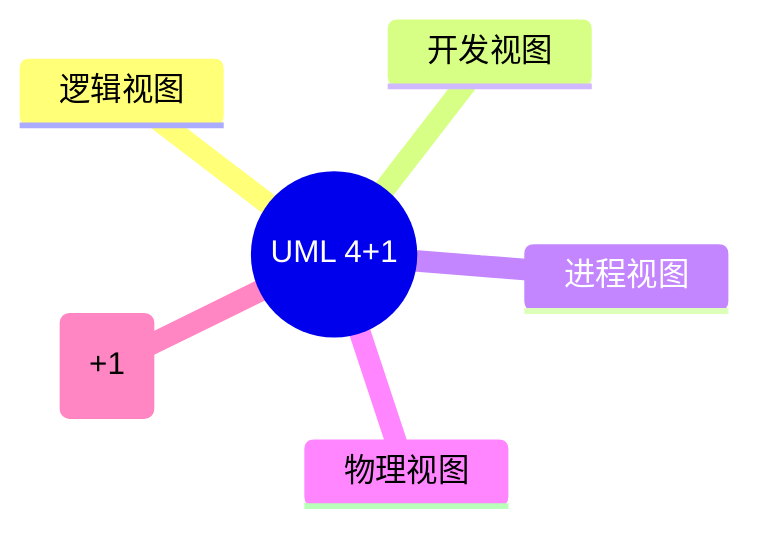

# 第六节 UML 4+1 视图

> 本文依据《第十一章 面向对象技术》PDF 中 **UML 4+1 视图模型**相关内容整理，保持课程原有知识体系，不扩展资料之外内容。

---

# 目录

1. UML 4+1 视图概述
2. 逻辑视图（Logical View）
3. 开发视图（Development View）
4. 进程视图（Process View）
5. 物理视图（Physical View）
6. 场景视图（Scenario / Use Case View）
7. 五种视图关系
8. 高频考点
9. 易错点
10. Mermaid 思维导图
11. 本节小结

---

# 1. UML 4+1 视图概述

UML 4+1 视图模型用于从不同角度描述软件系统架构，通过多个视图共同反映系统的静态结构与动态行为。课程资料将其作为软件架构建模的重要方法进行介绍。

---

# 2. 逻辑视图（Logical View）

描述系统的功能结构及主要对象、类及其关系，主要关注系统功能需求。

---

# 3. 开发视图（Development View）

描述软件模块、组件及其组织结构，主要面向开发人员，关注系统实现。

---

# 4. 进程视图（Process View）

描述系统运行过程中的进程、线程及并发关系，重点体现系统运行行为与性能。

---

# 5. 物理视图（Physical View）

描述系统部署到硬件节点后的结构，包括服务器、网络及部署关系。

---

# 6. 场景视图（Scenario / Use Case View）

通过典型用例或业务场景说明其他四种视图之间的协作关系，是“+1”视图。

---

# 7. 五种视图关系

| 视图 | 关注重点 |
|------|----------|
| 逻辑视图 | 功能结构 |
| 开发视图 | 软件组织结构 |
| 进程视图 | 并发与运行 |
| 物理视图 | 部署结构 |
| 场景视图 | 用例驱动、验证其他四种视图 |

---

# 8. 高频考点（★★★★★）

- UML 4+1 模型组成
- 五种视图的作用
- 场景视图为什么称“+1”
- 各视图适用对象

---

# 9. 易错点

| 易混知识 | 区别 |
|----------|------|
| 逻辑视图 vs 开发视图 | 功能结构；实现结构 |
| 开发视图 vs 物理视图 | 软件模块；硬件部署 |
| 进程视图 vs 场景视图 | 并发运行；业务用例 |

---

# 10. Mermaid 思维导图

---

# 11. 本节小结

UML 4+1 视图模型从五个不同角度描述系统架构。考试重点围绕五种视图的作用、关注重点及相互关系展开，应重点掌握“4+1”模型的组成及各视图的适用场景。
