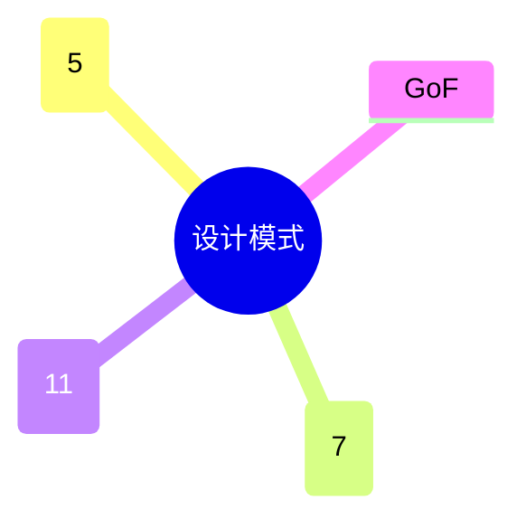

# 第七节 设计模式概述

> 本文依据《第十一章 面向对象技术》PDF 中**设计模式概述**相关内容整理，保持课程原有知识体系，不扩展资料之外内容。

---

# 目录

1. 设计模式概述
2. GoF 设计模式
3. 设计模式分类
4. 创建型模式
5. 结构型模式
6. 行为型模式
7. 设计模式的作用
8. 高频考点
9. 易错点
10. Mermaid 思维导图
11. 本节小结

---

# 1. 设计模式概述

设计模式（Design Pattern）是在软件开发过程中总结出的、能够反复使用的软件设计经验，用于解决特定场景下的设计问题，提高软件的可维护性、可扩展性和可复用性。

课程资料将设计模式作为面向对象设计的重要内容进行介绍。

---

# 2. GoF 设计模式

GoF（Gang of Four，四人帮）提出了经典的 **23 种设计模式**，课程资料按三大类进行学习：

- 创建型模式（Creational）
- 结构型模式（Structural）
- 行为型模式（Behavioral）

---

# 3. 设计模式分类

| 类别 | 数量 | 主要作用 |
|------|------:|----------|
| 创建型 | 5 种 | 对象创建 |
| 结构型 | 7 种 | 类或对象组合 |
| 行为型 | 11 种 | 对象之间职责与行为 |

---

# 4. 创建型模式

主要关注对象创建过程，使系统与对象创建过程解耦。

课程后续章节将分别介绍各创建型模式。

---

# 5. 结构型模式

主要关注类和对象之间的组合关系，使系统结构更加灵活。

课程后续章节将分别介绍各结构型模式。

---

# 6. 行为型模式

主要关注对象之间的通信与职责分配，提高系统协作能力。

课程后续章节将分别介绍各行为型模式。

---

# 7. 设计模式的作用

- 提高代码复用性
- 提高系统可维护性
- 提高系统可扩展性
- 降低耦合度
- 沉淀优秀设计经验

---

# 8. 高频考点（★★★★★）

- GoF 23 种设计模式
- 三大类设计模式
- 各类别的主要作用
- 设计模式应用价值

---

# 9. 易错点

| 易混知识 | 区别 |
|----------|------|
| 创建型 vs 结构型 | 创建对象；组织结构 |
| 结构型 vs 行为型 | 关注组合；关注协作 |
| 设计模式 vs UML | 设计经验；建模语言 |

---

# 10. Mermaid 思维导图

---

# 11. 本节小结

设计模式是面向对象设计的重要组成部分。课程资料重点围绕 GoF 提出的 23 种设计模式及其三大分类展开，应掌握分类方法、核心思想及应用价值，为后续学习各具体模式打下基础。
