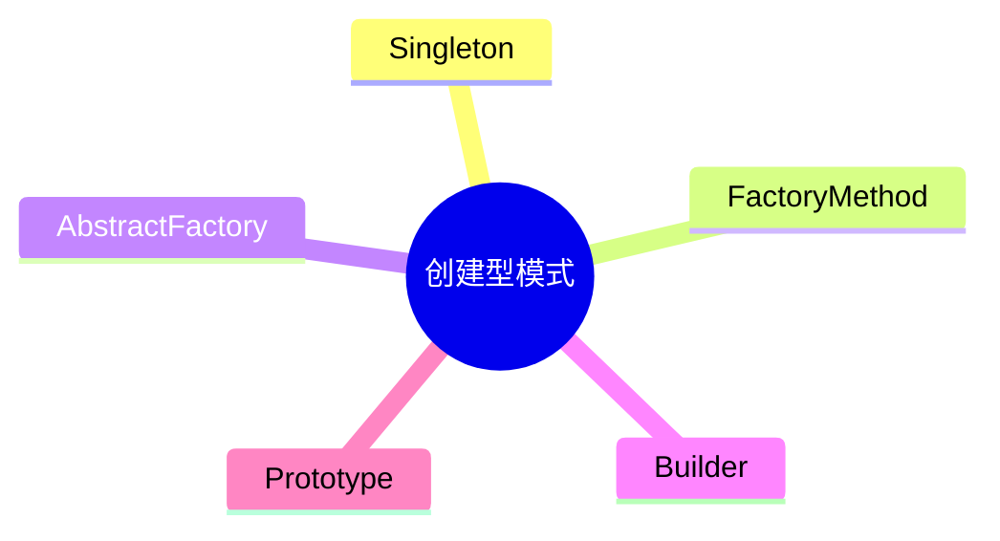

# 第八节 创建型模式

> 本文依据《第十一章 面向对象技术》PDF 中**创建型设计模式**相关内容整理，保持课程原有知识体系，不扩展资料之外内容。

---

# 目录

1. 创建型模式概述
2. 单例模式（Singleton）
3. 工厂方法模式（Factory Method）
4. 抽象工厂模式（Abstract Factory）
5. 建造者模式（Builder）
6. 原型模式（Prototype）
7. 五种创建型模式对比
8. 高频考点
9. 易错点
10. Mermaid 思维导图
11. 本节小结

---

# 1. 创建型模式概述

创建型设计模式主要解决**对象创建**问题，使对象创建过程与使用过程相分离，提高系统灵活性和可扩展性。课程资料将创建型模式作为 GoF 设计模式的重要组成部分进行介绍。

---

# 2. 单例模式（Singleton）

- 保证一个类仅有一个实例。
- 提供全局访问点。
- 适用于共享资源管理。

---

# 3. 工厂方法模式（Factory Method）

- 定义创建对象的接口。
- 由子类决定实例化哪一个具体类。
- 符合开闭原则。

---

# 4. 抽象工厂模式（Abstract Factory）

- 提供创建一系列相关对象的接口。
- 无需指定具体类即可创建产品族。

---

# 5. 建造者模式（Builder）

- 将复杂对象的构建过程与表示分离。
- 允许按步骤创建对象。

---

# 6. 原型模式（Prototype）

- 通过复制已有对象创建新对象。
- 减少重复创建开销。
- 基于对象克隆实现。

---

# 7. 五种创建型模式对比

| 模式 | 核心作用 |
|------|----------|
| 单例 | 唯一实例 |
| 工厂方法 | 延迟对象创建 |
| 抽象工厂 | 创建产品族 |
| 建造者 | 分步骤构建复杂对象 |
| 原型 | 克隆已有对象 |

---

# 8. 高频考点（★★★★★）

- 五种创建型模式名称
- 各模式适用场景
- 工厂方法与抽象工厂区别
- Builder 与 Prototype 区别
- Singleton 特点

---

# 9. 易错点

| 易混知识 | 区别 |
|----------|------|
| 工厂方法 vs 抽象工厂 | 创建单类产品；创建产品族 |
| Builder vs Prototype | 构建对象；复制对象 |
| Singleton vs 工厂模式 | 唯一实例；负责创建 |

---

# 10. Mermaid 思维导图

---

# 11. 本节小结

创建型设计模式主要关注对象创建过程。考试重点围绕五种创建型模式的核心思想、适用场景及区别展开，应重点掌握 Singleton、Factory Method、Abstract Factory、Builder 和 Prototype 的特点。
