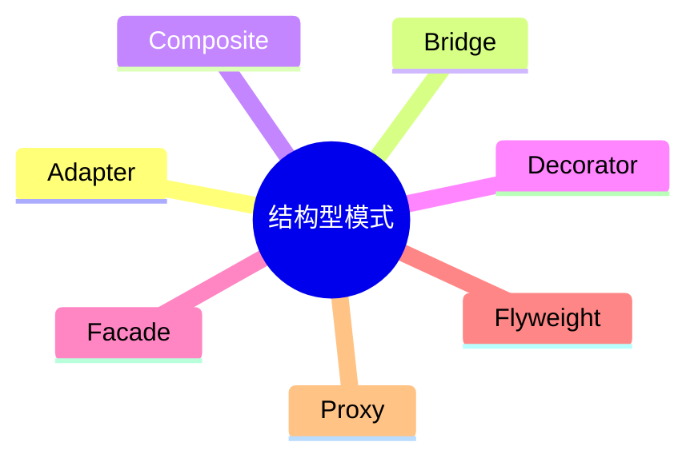

# 第九节 结构型模式

> 本文依据《第十一章 面向对象技术》PDF 中**结构型设计模式**相关内容整理，保持课程原有知识体系，不扩展资料之外内容。

---

# 目录

1. 结构型模式概述
2. 适配器模式（Adapter）
3. 桥接模式（Bridge）
4. 组合模式（Composite）
5. 装饰器模式（Decorator）
6. 外观模式（Facade）
7. 享元模式（Flyweight）
8. 代理模式（Proxy）
9. 七种结构型模式对比
10. 高频考点
11. 易错点
12. Mermaid 思维导图
13. 本节小结

---

# 1. 结构型模式概述

结构型设计模式主要关注**类与对象之间的组合关系**，通过合理组织对象结构，提高系统的灵活性、可扩展性与复用性。课程资料将其作为 GoF 设计模式三大类别之一进行介绍。

---

# 2. 适配器模式（Adapter）

- 将一个接口转换为客户期望的另一个接口。
- 解决接口不兼容问题。
- 又称“包装器模式”。

---

# 3. 桥接模式（Bridge）

- 将抽象部分与实现部分分离。
- 二者可以独立变化。
- 降低抽象与实现之间的耦合。

---

# 4. 组合模式（Composite）

- 将对象组织成树形结构。
- 统一处理单个对象与组合对象。
- 适用于整体—部分结构。

---

# 5. 装饰器模式（Decorator）

- 在不修改原有对象的前提下动态扩展功能。
- 比继承更加灵活。

---

# 6. 外观模式（Facade）

- 为子系统提供统一访问入口。
- 简化客户端调用。
- 降低系统复杂度。

---

# 7. 享元模式（Flyweight）

- 共享细粒度对象。
- 减少对象数量。
- 节省系统内存。

---

# 8. 代理模式（Proxy）

- 为目标对象提供代理对象。
- 控制对象访问。
- 可用于权限控制、远程代理、延迟加载等。

---

# 9. 七种结构型模式对比

| 模式 | 核心作用 |
|------|----------|
| Adapter | 接口转换 |
| Bridge | 抽象与实现分离 |
| Composite | 树形结构 |
| Decorator | 动态扩展功能 |
| Facade | 简化访问 |
| Flyweight | 共享对象 |
| Proxy | 控制访问 |

---

# 10. 高频考点（★★★★★）

- 七种结构型模式名称
- 各模式核心思想
- Adapter 与 Bridge 区别
- Decorator 与 Proxy 区别
- Composite 与 Facade 区别

---

# 11. 易错点

| 易混知识 | 区别 |
|----------|------|
| Adapter vs Bridge | 接口兼容；抽象与实现分离 |
| Decorator vs Proxy | 增强功能；控制访问 |
| Composite vs Facade | 树形组合；统一入口 |

---

# 12. Mermaid 思维导图

---

# 13. 本节小结

结构型设计模式主要解决对象组合与系统结构问题。考试重点围绕七种结构型模式的核心思想、适用场景及区别展开，应重点掌握各模式的典型用途及辨析。
