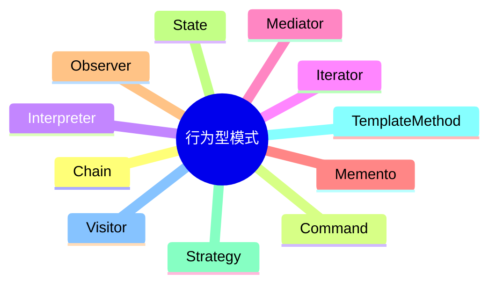

# 第十节 行为型模式

> 本文依据《第十一章 面向对象技术》PDF 中**行为型设计模式**相关内容整理，保持课程原有知识体系，不扩展资料之外内容。

---

# 目录

1. 行为型模式概述
2. 十一种行为型模式
3. 行为型模式对比
4. 高频考点
5. 易错点
6. Mermaid 思维导图
7. 本节小结

---

# 1. 行为型模式概述

行为型设计模式主要关注**对象之间的职责分配与通信方式**，通过合理组织对象之间的交互，提高系统的灵活性和可扩展性。课程资料将行为型模式作为 GoF 三大类设计模式之一进行介绍。

---

# 2. 十一种行为型模式

| 模式 | 核心作用 |
|------|----------|
| 职责链（Chain of Responsibility） | 请求沿责任链传递 |
| 命令（Command） | 请求封装为对象 |
| 解释器（Interpreter） | 定义语言文法并解释执行 |
| 迭代器（Iterator） | 顺序访问聚合对象 |
| 中介者（Mediator） | 统一对象之间通信 |
| 备忘录（Memento） | 保存与恢复对象状态 |
| 观察者（Observer） | 一对多通知机制 |
| 状态（State） | 状态改变引起行为改变 |
| 策略（Strategy） | 封装可替换算法 |
| 模板方法（Template Method） | 定义算法骨架 |
| 访问者（Visitor） | 分离数据结构与操作 |

---

# 3. 行为型模式对比

| 模式 | 典型特点 |
|------|----------|
| Strategy | 算法可替换 |
| State | 状态驱动行为 |
| Observer | 发布-订阅 |
| Command | 请求对象化 |
| Iterator | 遍历集合 |
| Mediator | 降低对象耦合 |
| Template Method | 固定流程、步骤可扩展 |

---

# 4. 高频考点（★★★★★）

- 十一种行为型模式名称
- Strategy 与 State 区别
- Observer 工作机制
- Command 与职责链区别
- Template Method 核心思想

---

# 5. 易错点

| 易混知识 | 区别 |
|----------|------|
| Strategy vs State | 算法切换；状态切换 |
| Observer vs Mediator | 发布订阅；集中协调 |
| Command vs Chain | 封装请求；传递请求 |

---

# 6. Mermaid 思维导图

---

# 7. 本节小结

行为型设计模式主要解决对象之间的职责划分和协作问题。考试重点围绕各模式的核心思想、适用场景及区别展开，应重点掌握 Strategy、Observer、State、Command 等高频模式。
