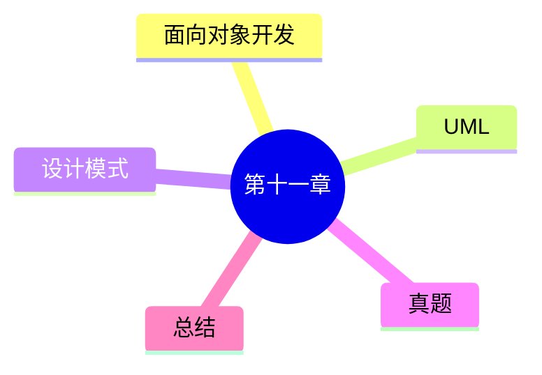

# 第十一章总结

> 本节依据第十一章课件整理，作为全章复习资料。

---

# 一、本章知识体系

```text
面向对象技术
│
├── 面向对象开发
│   ├── 对象、类
│   ├── 封装
│   ├── 继承
│   ├── 多态
│   ├── 消息、动态绑定
│   ├── OOA
│   └── OOD
│
├── UML
│   ├── UML基础
│   ├── UML关系
│   ├── UML图
│   └── UML 4+1视图
│
├── 设计模式
│   ├── 创建型（5）
│   ├── 结构型（7）
│   └── 行为型（11）
│
├── 章节练习
├── 历年真题
└── 本章总结
```

---

# 二、必背英文缩写

| 缩写 | 含义 |
|------|------|
| OOA | Object-Oriented Analysis |
| OOD | Object-Oriented Design |
| UML | Unified Modeling Language |
| GoF | Gang of Four |
| Class | 类 |
| Object | 对象 |
| Adapter | 适配器 |
| Singleton | 单例 |

---

# 三、易混知识对比

| 对比 | 区别 |
|------|------|
| 对象 vs 类 | 实例；模板 |
| OOA vs OOD | 分析；设计 |
| 聚合 vs 组合 | 生命周期独立；生命周期依赖 |
| 类图 vs 对象图 | 类定义；对象实例 |
| Factory Method vs Abstract Factory | 单个产品；产品族 |
| Strategy vs State | 算法切换；状态切换 |

---

# 四、高频考点（★★★★★）

- 面向对象四大特性
- OOA、OOD
- UML 四大关系
- UML 常见图
- UML 4+1 视图
- GoF 23 种设计模式
- 创建型、结构型、行为型设计模式

以上均为课程资料重点内容。

---

# 五、记忆建议

1. 四大特性结合实例理解。
2. UML 图按用途分类记忆。
3. 设计模式按三大类分类记忆。
4. 对易混模式采用对比学习。

---

# 六、Mermaid 思维导图



---

# 七、考前冲刺建议

- 优先掌握 UML 与设计模式。
- 熟悉课程中的典型图示和概念辨析。
- 结合章节练习和历年真题巩固高频考点。

---

# 八、本章总结

第十一章主要围绕面向对象思想、UML 建模和设计模式展开，是系统架构设计师考试的重要章节。建议结合本章全部 Markdown 文档进行系统复习，重点掌握高频考点及易混概念。
