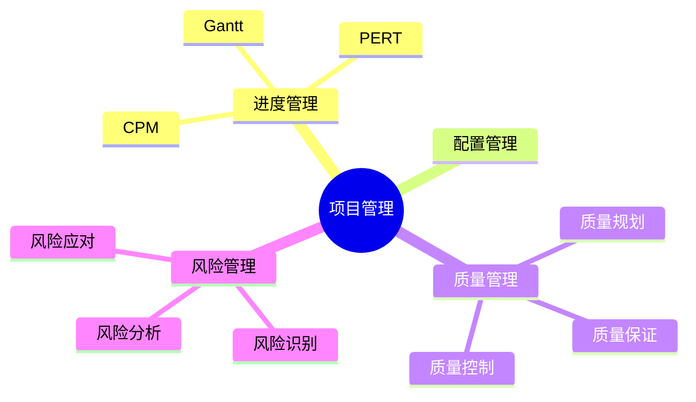

# 01 Project Management Overview（项目管理概述）

> 本文依据《12.项目管理.pdf》中项目管理概述相关内容整理，保持课程原有知识体系，用于系统架构设计师考试复习。

---

# 目录

1. 项目管理概述
2. 项目管理目标
3. 项目管理主要内容
4. 项目管理过程
5. 项目管理知识体系
6. 高频考点
7. 易错点
8. Mermaid 思维导图
9. 本节小结

---

# 1. 项目管理概述

项目管理是为了实现项目目标，对项目活动进行计划、组织、协调和控制的过程。

在系统架构设计师考试中，项目管理主要关注软件项目实施过程中的：

- 进度管理
- 软件配置管理
- 质量管理
- 风险管理


---

# 2. 项目管理目标

项目管理的主要目标包括：

- 按计划完成项目
- 控制项目成本
- 保证项目质量
- 降低项目风险
- 协调项目资源

---

# 3. 项目管理主要内容

本章主要介绍以下管理领域：

## 进度管理

关注项目活动安排和完成时间。

主要内容：

- 活动定义
- 活动排序
- 活动资源估算
- 活动历时估算
- 制定项目进度计划
- 进度控制

重点技术：

- 甘特图（Gantt）
- 项目计划评审技术（PERT）
- 关键路径法（CPM）


---

## 软件配置管理

用于管理软件产品及相关配置项的变化。

主要内容：

- 配置管理计划
- 配置标识
- 配置控制
- 配置状态报告
- 配置审计
- 发布管理和交付


---

## 质量管理

主要包括：

- 质量规划
- 质量保证
- 质量控制

目标是保证项目交付成果满足质量要求。


---

## 风险管理

风险管理主要包括：

- 风险管理计划编制
- 风险识别
- 风险定性分析
- 风险定量分析
- 风险应对计划
- 风险监控


---

# 4. 项目管理过程

项目管理通常围绕：

```text
计划

↓

执行

↓

监控

↓

控制

↓

交付
```

展开。

其中需要持续关注：

- 项目范围
- 时间
- 成本
- 质量
- 风险

---

# 5. 项目管理知识体系

本章知识结构：

```text
项目管理

├── 进度管理
│   ├── 甘特图
│   ├── PERT
│   └── CPM
│
├── 软件配置管理
│
├── 质量管理
│
└── 风险管理
```

---

# 6. 高频考点（★★★★★）

- 项目管理四大领域
- 进度管理过程
- 甘特图、PERT、CPM
- 软件配置管理内容
- 质量管理三个过程
- 风险管理流程

---

# 7. 易错点

| 易混知识 | 区别 |
|---|---|
| 质量保证 vs 质量控制 | 保证过程质量；检查产品结果 |
| 配置管理 vs 版本管理 | 管理配置项全过程；管理版本变化 |
| 风险识别 vs 风险分析 | 发现风险；评估风险 |

---

# 8. Mermaid 思维导图



---

# 9. 本节小结

项目管理是系统架构设计师考试的重要章节，主要围绕进度管理、软件配置管理、质量管理和风险管理展开。

其中：

- 进度管理中的 CPM 计算是重点；
- 配置管理、质量管理和风险管理主要考查概念理解。
