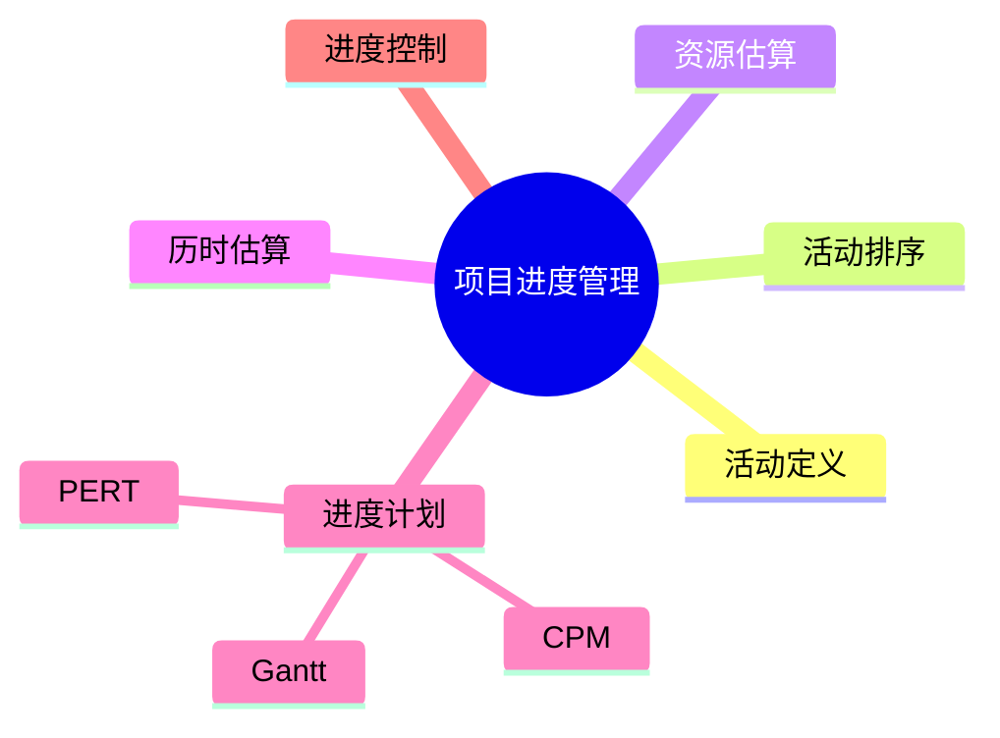

# 02 Progress Management（进度管理）

> 本文依据《12.项目管理.pdf》中项目进度管理相关内容整理，保持课程原有知识体系，用于系统架构设计师考试复习。

---

# 目录

1. 项目进度管理概述
2. 活动定义
3. 活动排序
4. 活动资源估算
5. 活动历时估算
6. 制定项目进度计划
7. 项目进度控制
8. 常用进度管理工具
9. 高频考点
10. 易错点
11. Mermaid 思维导图
12. 本节小结

---

# 1. 项目进度管理概述

项目进度管理是项目管理的重要组成部分，主要目标是保证项目按照计划时间完成。

项目进度管理主要包括：

- 活动定义
- 活动排序
- 活动资源估算
- 活动历时估算
- 制定项目进度计划
- 进度控制

---

# 2. 活动定义

活动定义是将项目工作分解为具体活动，明确项目需要完成的任务。

主要关注：

- 工作内容
- 活动范围
- 活动之间的关系

---

# 3. 活动排序

活动排序用于确定项目活动之间的先后关系。

常见关系：

- 前置活动
- 后续活动
- 依赖关系

通过活动排序，可以形成项目活动网络。

---

# 4. 活动资源估算

活动资源估算用于确定完成项目活动所需要的资源。

资源包括：

- 人员
- 设备
- 材料
- 工具

---

# 5. 活动历时估算

活动历时估算用于确定每项活动所需时间。

影响因素：

- 工作量
- 资源数量
- 技术难度
- 人员能力

---

# 6. 制定项目进度计划

制定项目进度计划是在活动定义、排序和估算基础上形成项目时间安排。

常用方法：

- 甘特图（Gantt）
- 项目计划评审技术（PERT）
- 关键路径法（CPM）

---

# 7. 项目进度控制

进度控制用于监控项目实际执行情况，并根据偏差进行调整。

主要内容：

- 比较实际进度与计划进度
- 分析进度偏差
- 采取纠正措施

---

# 8. 常用进度管理工具

## 8.1 甘特图（Gantt）

甘特图通过条形图展示：

- 活动名称
- 开始时间
- 结束时间
- 持续时间

特点：

- 直观展示项目计划
- 易于查看任务进度

---

## 8.2 PERT 项目计划评审技术

PERT 用于项目活动计划分析，通过网络图描述活动之间关系。

重点：

- 活动依赖关系
- 时间估算

---

## 8.3 CPM 关键路径法

关键路径法用于确定影响项目完成时间的关键活动。

特点：

- 关键路径决定项目最短完成时间
- 关键路径上的活动通常没有时间浮动

后续章节将详细介绍 CPM 计算方法。

---

# 9. 高频考点（★★★★★）

- 项目进度管理六个过程
- 甘特图作用
- PERT 与 CPM 区别
- 活动排序与依赖关系
- 进度控制过程

---

# 10. 易错点

| 易混知识 | 区别 |
|---|---|
| PERT vs CPM | 项目计划评审；关键路径计算 |
| 活动排序 vs 活动历时估算 | 确定关系；确定时间 |
| 计划进度 vs 实际进度 | 目标安排；实际执行 |

---

# 11. Mermaid 思维导图

---

# 12. 本节小结

项目进度管理是项目管理章节的重要内容，重点掌握六个管理过程以及甘特图、PERT、CPM 等进度管理工具。

其中 CPM 关键路径法是后续计算章节的重点，需要重点学习。
