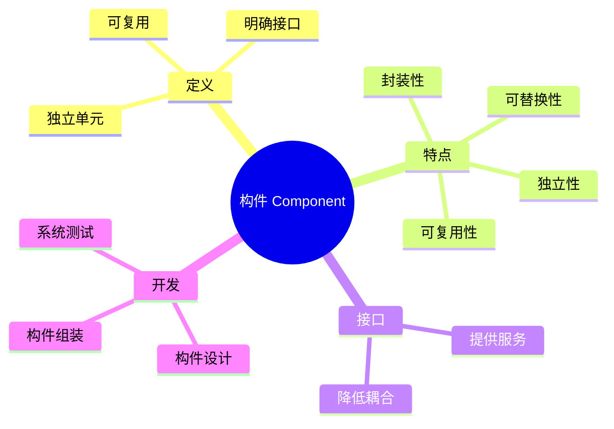

# 03 Component（构件）

> 本文依据《13.系统架构设计.pdf》中软件构件相关内容整理，用于系统架构设计师考试复习，保持课程知识体系。

---

# 目录

1. 构件概述
2. 构件定义
3. 构件特点
4. 构件接口
5. 构件复用
6. 构件化开发
7. 构件与软件架构
8. 高频考点
9. 易错点
10. Mermaid 思维导图
11. 本节小结

---

# 1. 构件概述

构件（Component）是软件架构中的重要组成部分。

在软件架构设计中，系统通常由多个构件组合而成，构件之间通过接口进行交互，共同完成系统功能。

构件化思想强调：

- 功能模块化
- 接口标准化
- 软件复用

---

# 2. 构件定义

构件是一个具有明确接口、可独立部署和复用的软件单元。

构件主要包含：

- 内部实现
- 对外提供的接口
- 与其他构件之间的协作关系

构件隐藏内部实现细节，通过接口提供服务。

---

# 3. 构件特点

构件具有以下特点：

## 3.1 独立性

构件能够相对独立存在，降低系统之间的依赖。

---

## 3.2 可复用性

构件可以在不同系统或不同场景中重复使用。

---

## 3.3 可替换性

在满足相同接口要求时，可以替换具体实现。

---

## 3.4 封装性

构件隐藏内部实现，只暴露必要接口。

---

# 4. 构件接口

接口是构件与外部环境交互的方式。

通过接口：

- 使用者调用构件功能
- 构件提供服务
- 降低耦合关系

构件设计重点：

```text
使用接口

↓

调用构件

↓

获得服务
```

---

# 5. 构件复用

构件复用是构件化开发的重要目标。

复用方式：

## 5.1 黑盒复用

特点：

- 不关注内部实现
- 通过接口直接使用

---

## 5.2 白盒复用

特点：

- 可以查看或修改内部实现

---

构件复用优势：

- 提高开发效率
- 降低开发成本
- 提高软件质量

---

# 6. 构件化开发

构件化开发以构件作为基本开发单元。

主要过程：

```text
需求分析

↓

构件设计

↓

构件开发

↓

构件组装

↓

系统测试
```

核心思想：

通过已有构件组合构建软件系统。

---

# 7. 构件与软件架构

软件架构描述系统整体结构。

构件是架构中的基本组成元素。

关系：

```text
软件架构

↓

架构元素

↓

构件

↓

接口交互
```

合理的构件设计能够提高：

- 可维护性
- 可扩展性
- 可复用性

---

# 8. 高频考点（★★★★★）

重点掌握：

- 构件定义
- 构件特点
- 构件接口作用
- 构件复用思想
- 构件与软件架构关系

---

# 9. 易错点

| 易混知识 | 区别 |
|---|---|
| 模块 vs 构件 | 模块是功能划分；构件强调独立部署和复用 |
| 接口 vs 实现 | 接口提供服务；实现完成功能 |
| 类 vs 构件 | 类是面向对象基本单位；构件是架构级软件单元 |

---

# 10. Mermaid 思维导图



---

# 11. 本节小结

构件是软件架构设计中的核心组成元素。

本节重点：

- 理解构件定义
- 掌握构件特点
- 理解接口与实现关系
- 掌握构件复用和构件化开发思想

后续章节将在构件基础上继续学习层次架构、MVC/MVP/MVVM 等架构模式。
