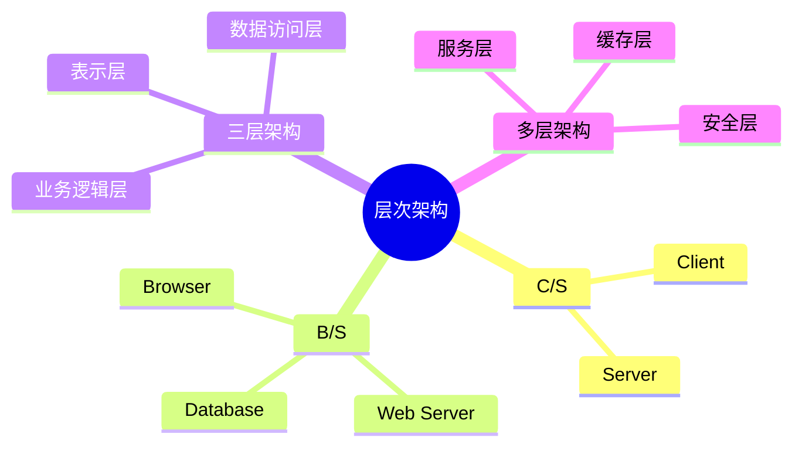

# 04 Layered Architecture（层次架构）

> 本文依据《13.系统架构设计.pdf》中层次架构相关内容整理，用于系统架构设计师考试复习，保持课程知识体系。

---

# 目录

1. 层次架构概述
2. C/S 架构
3. B/S 架构
4. 三层架构
5. 多层架构
6. C/S 与 B/S 对比
7. 层次架构优缺点
8. 高频考点
9. 易错点
10. Mermaid 思维导图
11. 本节小结

---

# 1. 层次架构概述

层次架构（Layered Architecture）是一种按照职责将系统划分为多个层次的软件架构风格。

不同层负责不同功能，上层通过接口调用下层服务。

典型结构：

```text
表示层

↓

业务逻辑层

↓

数据访问层

↓

数据库
```

层次架构的目标：

- 降低系统复杂度
- 提高可维护性
- 提高系统扩展能力

---

# 2. C/S 架构

C/S（Client/Server，客户端/服务器）架构是一种经典的软件架构模式。

结构：

```text
客户端

↓

服务器
```

客户端负责：

- 用户界面
- 部分业务处理

服务器负责：

- 数据管理
- 核心业务服务

---

## C/S 架构特点

优点：

- 客户端功能丰富
- 响应速度较快
- 可以充分利用客户端资源

缺点：

- 客户端部署复杂
- 升级维护困难
- 对环境依赖较强

---

# 3. B/S 架构

B/S（Browser/Server，浏览器/服务器）架构是在 C/S 基础上发展的一种架构形式。

结构：

```text
浏览器

↓

Web服务器

↓

数据库服务器
```

---

## B/S 架构特点

优点：

- 客户端无需安装专用软件
- 部署方便
- 维护成本低
- 易于统一管理

缺点：

- 对网络依赖较强
- 部分复杂交互体验受限制

---

# 4. 三层架构

三层架构将系统划分为：

```text
表示层

↓

业务逻辑层

↓

数据访问层
```

---

## 4.1 表示层

负责：

- 用户交互
- 页面展示
- 输入输出处理

---

## 4.2 业务逻辑层

负责：

- 业务规则
- 核心业务处理
- 业务流程控制

---

## 4.3 数据访问层

负责：

- 数据存取
- 数据库访问
- 数据持久化

---

# 5. 多层架构

多层架构是在三层架构基础上的扩展。

可能增加：

- 服务层
- 接口层
- 缓存层
- 安全层

结构示例：

```text
表示层

↓

服务层

↓

业务层

↓

数据访问层

↓

数据库
```

优势：

- 职责更加清晰
- 便于大型系统扩展

---

# 6. C/S 与 B/S 对比

| 对比项 | C/S | B/S |
|---|---|---|
| 客户端 | 专用程序 | 浏览器 |
| 部署 | 复杂 | 简单 |
| 维护 | 困难 | 方便 |
| 网络依赖 | 较低 | 较高 |
| 应用场景 | 桌面应用 | Web应用 |

---

# 7. 层次架构优缺点

## 优点

- 结构清晰
- 职责分离
- 易维护
- 易扩展
- 支持复用

---

## 缺点

- 层次过多可能降低性能
- 层间通信增加复杂度
- 不合理分层会导致设计复杂

---

# 8. 高频考点（★★★★★）

重点掌握：

- C/S 与 B/S 特点
- 三层架构组成
- 表示层、业务层、数据层职责
- 多层架构优势
- 层次架构优缺点

---

# 9. 易错点

| 易混知识 | 区别 |
|---|---|
| C/S vs B/S | 客户端程序；浏览器访问 |
| 三层架构 vs MVC | 分层结构；表现层设计模式 |
| 业务层 vs 数据层 | 业务规则；数据存取 |

---

# 10. Mermaid 思维导图



---

# 11. 本节小结

层次架构是系统架构设计中的重要架构风格。

本节重点：

- 理解 C/S、B/S 架构特点
- 掌握三层架构职责划分
- 理解多层架构扩展方式
- 能够根据应用场景选择合适架构模式
