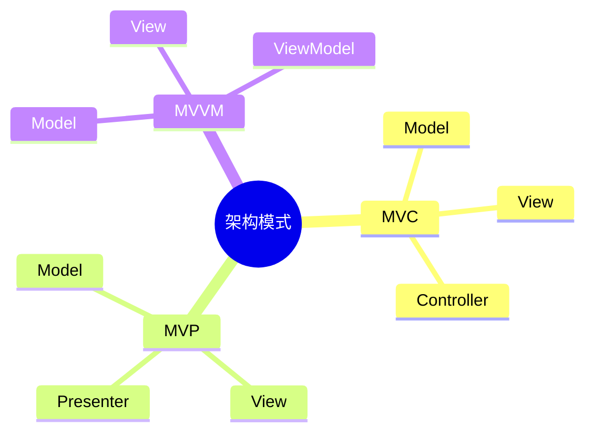

# 05 MVC MVP MVVM（MVC、MVP、MVVM 架构模式）

> 本文依据《13.系统架构设计.pdf》中层次架构及相关架构模式内容整理，用于系统架构设计师考试复习，保持课程知识体系。

---

# 目录

1. MVC 架构模式概述
2. MVC 三个核心组成
3. MVC 工作流程
4. MVP 架构模式
5. MVVM 架构模式
6. MVC、MVP、MVVM 对比
7. 前端架构中的应用
8. 高频考点
9. 易错点
10. Mermaid 思维导图
11. 本节小结

---

# 1. MVC 架构模式概述

MVC（Model-View-Controller）是一种经典的软件架构模式。

它将系统划分为三个部分：

```text
Model

View

Controller
```

通过职责分离降低系统耦合，提高软件的可维护性。

---

# 2. MVC 三个核心组成

## 2.1 Model（模型）

Model 负责：

- 数据管理
- 业务逻辑处理
- 数据状态维护

Model 不负责界面显示。

---

## 2.2 View（视图）

View 负责：

- 用户界面展示
- 数据显示
- 用户交互界面

View 关注：

> 如何展示数据。

---

## 2.3 Controller（控制器）

Controller 负责：

- 接收用户请求
- 调用 Model
- 更新 View

Controller 是 Model 和 View 之间的协调者。

---

# 3. MVC 工作流程

典型流程：

```text
用户操作

↓

Controller

↓

Model

↓

View

↓

用户看到结果
```

MVC 的核心思想：

- 数据和显示分离
- 控制逻辑独立
- 降低模块之间耦合

---

# 4. MVP 架构模式

MVP（Model-View-Presenter）是在 MVC 基础上的一种改进模式。

结构：

```text
Model

↑

Presenter

↓

View
```

---

## MVP 三个组成

### Model

负责：

- 数据
- 业务逻辑

---

### View

负责：

- 页面展示
- 用户交互

View 通常比较被动。

---

### Presenter

负责：

- 处理业务交互
- 调用 Model
- 控制 View 更新

Presenter 将业务逻辑从 View 中分离出来。

---

# 5. MVVM 架构模式

MVVM（Model-View-ViewModel）是一种常见的软件架构模式。

结构：

```text
View

↓

ViewModel

↓

Model
```

---

## MVVM 三个组成

### Model

负责：

- 数据
- 业务逻辑

---

### View

负责：

- 用户界面

---

### ViewModel

负责：

- 连接 View 和 Model
- 数据转换
- 状态管理

MVVM 常结合数据绑定机制。

---

# 6. MVC、MVP、MVVM 对比

| 模式 | 核心中间层 | 特点 |
|---|---|---|
| MVC | Controller | 控制请求和协调模型视图 |
| MVP | Presenter | View 被动展示 |
| MVVM | ViewModel | 支持数据绑定 |

---

## 三者演化关系

```text
MVC

↓

MVP

↓

MVVM
```

演化目标：

- 降低耦合
- 提高测试能力
- 提升代码维护性

---

# 7. 前端架构中的应用

现代前端开发中，经常采用类似 MVVM 的设计思想。

例如：

- 数据状态管理
- 组件化开发
- 数据驱动视图

核心思想：

```text
数据变化

↓

状态更新

↓

界面自动刷新
```

---

# 8. 高频考点（★★★★★）

重点掌握：

- MVC 三个组成部分
- Model、View、Controller职责
- MVP 中 Presenter 作用
- MVVM 中 ViewModel 作用
- MVC、MVP、MVVM区别

---

# 9. 易错点

| 易混知识 | 区别 |
|---|---|
| MVC vs MVP | Controller协调；Presenter处理业务 |
| MVP vs MVVM | Presenter主动控制；ViewModel数据绑定 |
| Model vs ViewModel | 数据业务模型；视图状态模型 |

---

# 10. Mermaid 思维导图



---

# 11. 本节小结

MVC、MVP、MVVM 是常见的软件架构模式。

重点理解：

- MVC 的职责划分
- MVP 对 MVC 的改进
- MVVM 的数据绑定思想
- 三种模式之间的演化关系

这些模式在 Web 系统和前端系统架构设计中具有重要应用价值。
