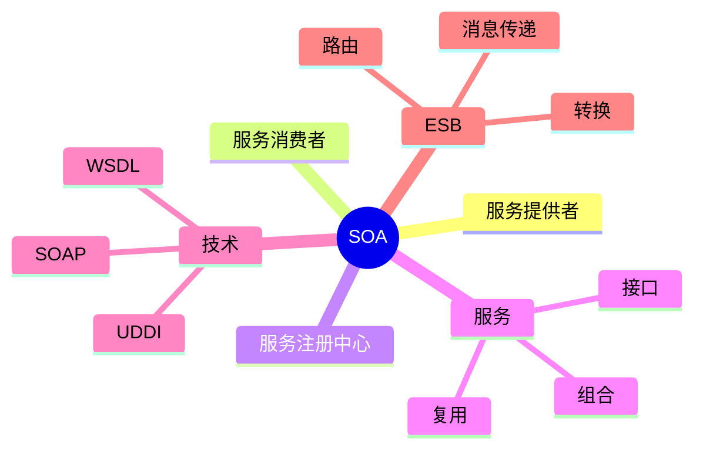

# 06 SOA（面向服务架构）

> 本文依据《13.系统架构设计.pdf》中面向服务架构（SOA）相关内容整理，用于系统架构设计师考试复习，保持课程知识体系。

---

# 目录

1. SOA 概述
2. SOA 基本思想
3. SOA 核心角色
4. SOA 服务模型
5. 服务注册与发现
6. SOA 相关技术
7. ESB 企业服务总线
8. SOA 优缺点
9. 高频考点
10. 易错点
11. Mermaid 思维导图
12. 本节小结

---

# 1. SOA 概述

SOA（Service-Oriented Architecture，面向服务架构）是一种软件架构风格。

SOA 将系统功能封装为服务，通过标准接口进行通信，实现不同系统之间的集成。

SOA 的核心目标：

- 服务复用
- 松耦合
- 系统集成
- 提高系统扩展能力

---

# 2. SOA 基本思想

SOA 的核心思想：

> 将软件功能组织成可复用、可组合的服务。

服务具有：

- 明确接口
- 独立实现
- 标准通信方式

系统通过调用服务完成业务功能。

---

# 3. SOA 核心角色

SOA 通常包含三个主要角色：

## 3.1 服务提供者（Service Provider）

负责：

- 创建服务
- 发布服务
- 提供服务实现

---

## 3.2 服务消费者（Service Consumer）

负责：

- 查找服务
- 调用服务
- 使用服务功能

---

## 3.3 服务注册中心（Service Registry）

负责：

- 保存服务信息
- 提供服务查询
- 支持服务发现

---

# 4. SOA 服务模型

SOA 基本交互过程：

```text
服务提供者

↓

发布服务

↓

服务注册中心

↓

查询服务

↓

服务消费者调用
```

服务之间通过接口进行交互。

---

# 5. 服务注册与发现

服务注册与发现是 SOA 的重要机制。

流程：

```text
服务提供者

↓

注册服务

↓

消费者查询

↓

调用服务
```

优点：

- 降低服务之间耦合
- 提高服务复用能力

---

# 6. SOA 相关技术

## 6.1 SOAP

SOAP（Simple Object Access Protocol）：

一种基于 XML 的服务通信协议。

作用：

- 定义消息格式
- 实现服务通信

---

## 6.2 WSDL

WSDL（Web Services Description Language）：

用于描述 Web Service 服务。

主要描述：

- 服务接口
- 服务操作
- 服务访问方式

---

## 6.3 UDDI

UDDI（Universal Description, Discovery and Integration）：

用于服务注册和发现。

作用：

- 发布服务信息
- 查询服务信息

---

# 7. ESB 企业服务总线

ESB（Enterprise Service Bus）是 SOA 中的重要基础设施。

作用：

- 服务连接
- 消息传递
- 协议转换
- 服务路由

结构：

```text
服务A

  ↓

 ESB

  ↓

服务B
```

ESB 可以降低系统之间直接依赖。

---

# 8. SOA 优缺点

## 优点

- 服务复用
- 松耦合
- 易扩展
- 支持系统集成

---

## 缺点

- 系统复杂度增加
- 服务治理要求较高
- 通信开销增加

---

# 9. 高频考点（★★★★★）

重点掌握：

- SOA 定义
- SOA 核心思想
- 服务提供者、消费者、注册中心
- SOAP、WSDL、UDDI 作用
- ESB 功能

---

# 10. 易错点

| 易混知识 | 区别 |
|---|---|
| SOAP vs WSDL | 通信协议；服务描述 |
| WSDL vs UDDI | 描述服务；注册发现 |
| SOA vs 微服务 | 面向服务架构；更细粒度服务架构思想 |
| 服务提供者 vs 消费者 | 提供服务；使用服务 |

---

# 11. Mermaid 思维导图



---

# 12. 本节小结

SOA 是系统架构设计中的重要架构风格。

本节重点：

- 理解 SOA 面向服务思想
- 掌握服务提供者、消费者和注册中心关系
- 理解 SOAP、WSDL、UDDI 作用
- 掌握 ESB 在 SOA 中的作用

后续章节将继续学习 Web Service、DSSA 和基于架构的软件开发方法。
