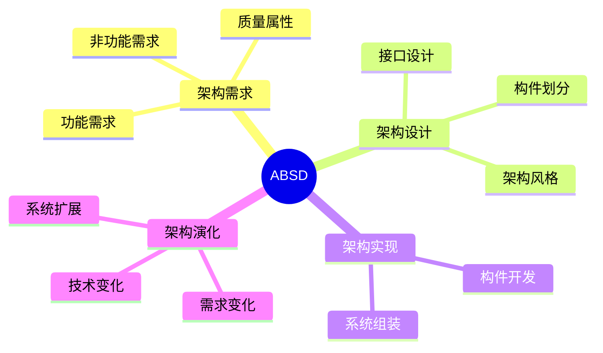

# 09 ABSD（基于架构的软件开发）

> 本文依据《13.系统架构设计.pdf》中 ABSD（Architecture-Based Software Development，基于架构的软件开发）相关内容整理，用于系统架构设计师考试复习，保持课程知识体系。

---

# 目录

1. ABSD 概述
2. ABSD 基本思想
3. ABSD 核心活动
4. 架构需求
5. 架构设计
6. 架构实现
7. 架构演化
8. ABSD 特点
9. ABSD 与传统开发方法对比
10. 高频考点
11. 易错点
12. Mermaid 思维导图
13. 本节小结

---

# 1. ABSD 概述

ABSD（Architecture-Based Software Development）即基于架构的软件开发。

ABSD 是一种以软件架构为核心的软件开发方法。

其核心思想：

> 在软件开发过程中，将架构设计作为核心活动，通过架构指导系统开发。

---

# 2. ABSD 基本思想

传统软件开发通常从功能需求出发进行设计。

ABSD 强调：

- 架构优先
- 质量属性驱动
- 架构指导开发
- 支持架构演化

通过明确系统整体架构，提高软件系统的质量和可维护性。

---

# 3. ABSD 核心活动

ABSD 主要包括：

```text
架构需求

↓

架构设计

↓

架构实现

↓

架构演化
```

这几个阶段贯穿软件开发过程。

---

# 4. 架构需求

架构需求阶段主要分析系统对架构的要求。

主要关注：

- 功能需求
- 非功能需求
- 质量属性需求
- 约束条件

其中非功能需求对架构设计具有重要影响。

例如：

- 性能要求
- 安全要求
- 可扩展要求
- 可维护要求

---

# 5. 架构设计

架构设计阶段根据需求确定系统整体结构。

主要工作：

- 确定架构风格
- 划分系统构件
- 定义构件关系
- 设计接口

输出：

- 软件架构方案

---

# 6. 架构实现

架构实现阶段根据架构设计进行系统开发。

主要内容：

- 实现架构中的构件
- 完成构件组装
- 验证架构设计

目标：

保证实现结果符合架构要求。

---

# 7. 架构演化

软件系统在生命周期中会不断变化。

架构演化关注：

- 需求变化
- 技术变化
- 系统扩展

通过调整架构，使系统能够适应变化。

---

# 8. ABSD 特点

## 8.1 架构驱动

软件架构是开发过程的核心。

---

## 8.2 关注质量属性

重点考虑：

- 性能
- 可用性
- 安全性
- 可修改性

---

## 8.3 支持系统演化

通过良好架构设计降低后期修改成本。

---

# 9. ABSD 与传统开发方法对比

| 对比项 | ABSD | 传统开发 |
|---|---|---|
| 核心 | 软件架构 | 功能实现 |
| 关注 | 整体结构和质量属性 | 功能需求 |
| 过程 | 架构驱动 | 需求驱动 |
| 目标 | 构建可演化系统 | 完成功能开发 |

---

# 10. 高频考点（★★★★★）

重点掌握：

- ABSD 定义
- ABSD 核心思想
- ABSD 四个活动
- 架构需求内容
- 架构设计任务
- 架构演化作用

---

# 11. 易错点

| 易混知识 | 区别 |
|---|---|
| DSSA vs ABSD | 面向领域复用；面向架构开发 |
| 架构设计 vs 详细设计 | 系统整体结构；具体实现细节 |
| 架构需求 vs 功能需求 | 架构约束和质量要求；业务功能 |

---

# 12. Mermaid 思维导图



---

# 13. 本节小结

ABSD 是系统架构设计中的重要开发方法。

本节重点：

- 理解 ABSD 的架构驱动思想
- 掌握架构需求、架构设计、架构实现、架构演化过程
- 理解 ABSD 对系统质量和演化能力的提升作用

后续章节将继续学习软件架构评估方法。
