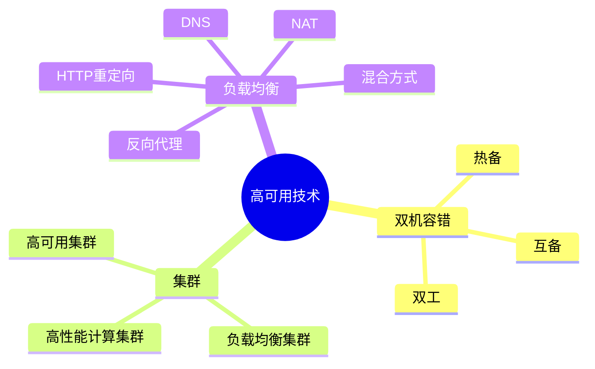

# 06 High Availability（高可用技术）

> 本文依据《14.软件可靠性基础.pdf》整理，用于系统架构设计师考试复习。主要介绍双机容错、集群技术以及负载均衡技术。

---

# 目录

1. 高可用技术概述
2. 双机容错技术
3. 双机热备
4. 双机互备
5. 双机双工
6. 集群技术
7. 高性能计算集群
8. 负载均衡集群
9. 高可用集群
10. 负载均衡技术
11. 高频考点
12. 易错点
13. Mermaid 思维导图
14. 本节小结

---

# 1. 高可用技术概述

高可用（High Availability，HA）技术是提高系统可靠性和连续服务能力的重要技术。

主要目标：

- 减少系统停机时间；
- 提高系统服务连续性；
- 快速恢复故障。

高可用技术通常通过：

- 冗余；
- 故障检测；
- 自动切换；

实现系统稳定运行。

---

# 2. 双机容错技术

双机容错是通过两台计算机协同工作，提高系统可靠性的技术。

基本思想：

```text
主机

↓

故障检测

↓

备用机接管服务
```

当一台机器发生故障时，另一台机器继续提供服务。

---

# 3. 双机热备

双机热备（Hot Standby）：

特点：

- 主机运行服务；
- 备用机处于等待状态；
- 主机故障后备用机立即接管。

结构：

```text
主机（工作）

↓

故障

↓

备用机（接管）
```

优点：

- 切换速度快；
- 服务中断时间短。

缺点：

- 备用资源利用率较低。

---

# 4. 双机互备

双机互备：

两台机器互为备用。

特点：

- 两台机器都可以运行不同业务；
- 任意一台故障时，另一台承担全部或部分业务。

优点：

- 提高资源利用率。

缺点：

- 故障切换复杂。

---

# 5. 双机双工

双机双工：

两台机器同时工作。

特点：

- 两台设备同时提供服务；
- 可以共同承担业务压力。

优点：

- 资源利用充分；
- 提高处理能力。

缺点：

- 系统设计复杂。

---

# 6. 集群技术

集群（Cluster）是由多个计算机组成的系统。

多个节点通过协同工作，提高：

- 性能；
- 可用性；
- 扩展能力。

集群主要类型：

- 高性能计算集群；
- 负载均衡集群；
- 高可用集群。

---

# 7. 高性能计算集群

高性能计算集群（High Performance Computing Cluster）：

目标：

提高计算能力。

特点：

- 多节点协同计算；
- 适用于复杂计算任务。

应用：

- 科学计算；
- 工程计算。

---

# 8. 负载均衡集群

负载均衡集群通过多个节点分担访问压力。

结构：

```text
用户请求

↓

负载均衡设备

↓

服务器1
服务器2
服务器N
```

优点：

- 提高处理能力；
- 提升系统扩展能力。

---

# 9. 高可用集群

高可用集群重点保证服务连续性。

特点：

- 节点监控；
- 故障检测；
- 自动切换。

目标：

减少服务中断时间。

---

# 10. 负载均衡技术

常见负载均衡方式：

---

## 10.1 HTTP 重定向

通过服务器返回重定向地址，将请求分配给不同服务器。

特点：

- 实现简单；
- 增加一次请求。

---

## 10.2 DNS 负载均衡

通过 DNS 返回不同服务器地址。

特点：

- 实现简单；
- 缓存影响切换速度。

---

## 10.3 NAT 负载均衡

通过网络地址转换实现请求分发。

特点：

- 对客户端透明；
- 支持多服务器。

---

## 10.4 反向代理负载均衡

由代理服务器接收请求，再转发给后端服务器。

特点：

- 控制能力强；
- 支持应用层处理。

---

## 10.5 混合型负载均衡

结合多种负载均衡方式。

特点：

- 适用于大型系统；
- 提高系统处理能力。

---

# 11. 高频考点（★★★★★）

重点掌握：

- 双机热备、互备、双工区别；
- 集群三种类型；
- 高可用集群特点；
- 负载均衡常见方式；
- 高可用技术目标。

---

# 12. 易错点

| 易错知识 | 正确理解 |
|---|---|
| 热备两台机器同时工作 | 主机工作，备用机等待 |
| 双机互备没有备用关系 | 两台互为备用 |
| 集群只提高性能 | 集群还能提高可靠性和可用性 |
| 负载均衡等于集群 | 负载均衡是实现集群能力的一种方式 |

---

# 13. Mermaid 思维导图



---

# 14. 本节小结

高可用技术是保证系统持续运行的重要技术。

本节重点：

- 理解双机容错三种模式；
- 掌握集群技术分类；
- 理解负载均衡实现方式；
- 能够根据应用场景选择合适的高可用方案。

后续章节将继续学习软件可靠性测试与评价。
