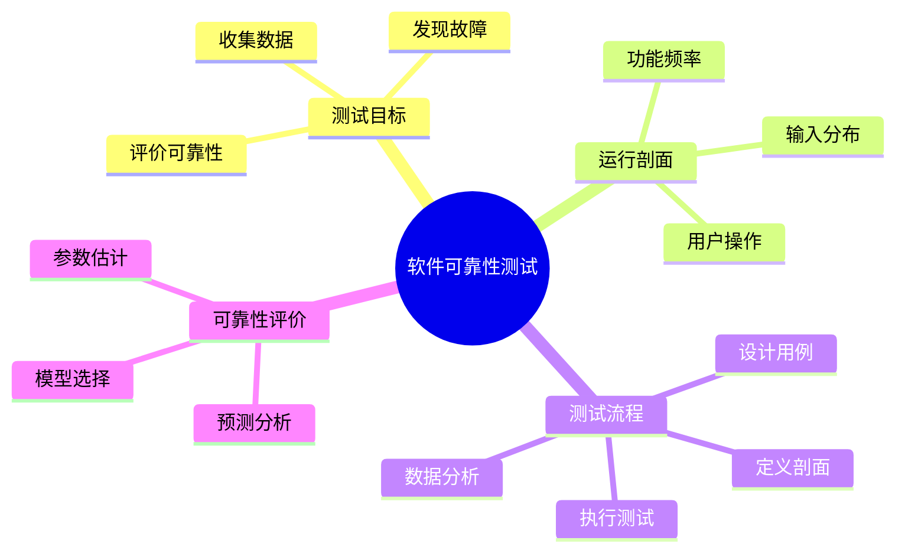

# 07 Reliability Testing（软件可靠性测试与评价）

> 本文依据《14.软件可靠性基础.pdf》整理，用于系统架构设计师考试复习。主要介绍软件可靠性测试目标、测试流程、可靠性数据收集以及可靠性评价方法。

---

# 目录

1. 软件可靠性测试概述
2. 可靠性测试目标
3. 软件运行剖面
4. 可靠性测试流程
5. 可靠性测试数据收集
6. 可靠性评价与预测
7. 高频考点
8. 易错点
9. Mermaid 思维导图
10. 本节小结

---

# 1. 软件可靠性测试概述

软件可靠性测试是通过模拟软件实际运行环境，对软件可靠性进行验证和评价的测试活动。

主要目的：

- 发现软件可靠性问题；
- 收集软件故障数据；
- 评价软件可靠性水平；
- 预测软件未来运行情况。

---

# 2. 可靠性测试目标

软件可靠性测试主要关注：

## 2.1 发现故障

通过测试发现：

- 程序缺陷；
- 运行异常；
- 潜在可靠性问题。

---

## 2.2 测量可靠性指标

通过测试数据计算：

- 故障次数；
- 故障间隔时间；
- 平均无故障时间。

---

## 2.3 评价可靠性水平

判断软件是否满足：

- 可靠性要求；
- 可用性要求；
- 质量目标。

---

# 3. 软件运行剖面

软件运行剖面（Operational Profile）描述软件实际运行过程中：

- 用户操作情况；
- 功能使用频率；
- 输入数据分布。

作用：

使可靠性测试更加接近真实运行环境。

---

# 4. 可靠性测试流程

典型流程：

```text
定义软件运行剖面

↓

设计可靠性测试用例

↓

实施可靠性测试

↓

记录故障数据

↓

分析测试结果

↓

评价可靠性
```

---

# 5. 可靠性测试数据收集

可靠性分析需要收集：

## 5.1 故障数据

包括：

- 故障发生时间；
- 故障次数；
- 故障类型；
- 故障原因。

---

## 5.2 运行数据

包括：

- 软件运行时间；
- 使用环境；
- 用户操作情况。

---

## 5.3 测试数据应用

测试数据用于：

- 建立可靠性模型；
- 计算可靠性指标；
- 预测软件可靠性趋势。

---

# 6. 可靠性评价与预测

可靠性评价过程：

```text
选择可靠性模型

↓

收集可靠性数据

↓

估计模型参数

↓

计算可靠性指标

↓

进行可靠性评价和预测
```

评价内容包括：

- 当前可靠性水平；
- 是否达到目标；
- 未来可靠性趋势。

---

# 7. 高频考点（★★★★★）

重点掌握：

- 软件可靠性测试目的；
- 软件运行剖面作用；
- 可靠性测试流程；
- 可靠性数据类型；
- 可靠性评价过程。

---

# 8. 易错点

| 易错知识 | 正确理解 |
|---|---|
| 可靠性测试只发现错误 | 还需要评价可靠性水平 |
| 运行剖面是测试计划 | 运行剖面描述实际使用情况 |
| 测试结束代表可靠性确定 | 需要模型分析和预测 |
| 可靠性评价不需要数据 | 可靠性评价依赖测试数据 |

---

# 9. Mermaid 思维导图



---

# 10. 本节小结

软件可靠性测试是验证和评价软件可靠性的重要手段。

本节重点：

- 理解可靠性测试目标；
- 掌握可靠性测试流程；
- 理解软件运行剖面的作用；
- 掌握可靠性数据收集和评价方法。

后续章节将继续生成章节练习、历年真题和总结文档。
