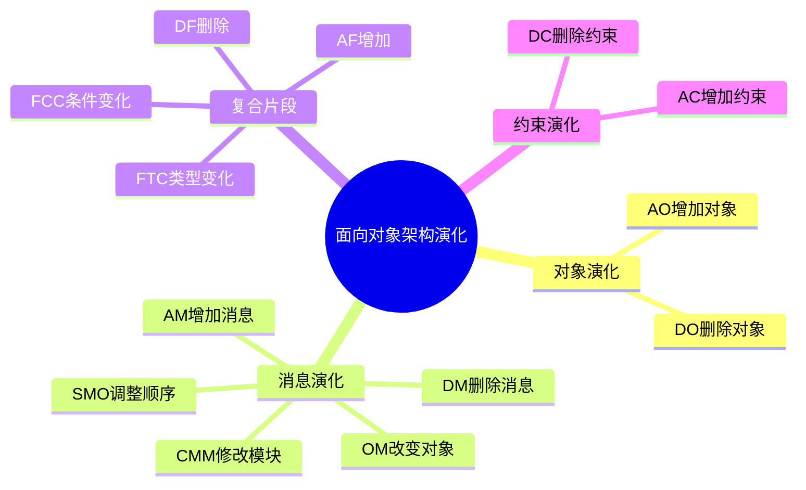

# 02 Object Oriented Architecture Evolution（面向对象软件架构演化）

> 本文依据《15.软件架构的演化和维护.pdf》整理，用于系统架构设计师考试复习。主要介绍面向对象软件架构演化中的对象演化、消息演化、复合片段演化以及约束演化。

---

# 目录

1. 面向对象软件架构演化概述
2. 对象演化
3. 消息演化
4. 复合片段演化
5. 约束演化
6. 演化操作总结
7. 高频考点
8. 易错点
9. Mermaid 思维导图
10. 本节小结

---

# 1. 面向对象软件架构演化概述

面向对象软件架构演化主要关注软件系统中：

- 对象；
- 对象之间的消息交互；
- UML模型元素；
- 约束关系；

随着需求变化而发生的调整。

面向对象架构演化通常通过对模型元素进行增加、删除、修改等操作实现。

主要演化对象包括：

- 对象演化；
- 消息演化；
- 复合片段演化；
- 约束演化。


---

# 2. 对象演化

对象演化主要针对系统中的对象进行调整。

包括两种基本操作：

---

## 2.1 Add Object（AO）

增加对象。

表示：

> 在原有软件架构中增加新的对象。

应用场景：

- 增加新的业务实体；
- 扩展系统功能；
- 增加新的服务对象。

---

## 2.2 Delete Object（DO）

删除对象。

表示：

> 从系统架构中移除已有对象。

应用场景：

- 删除废弃功能；
- 简化系统结构；
- 降低系统复杂度。

---

# 3. 消息演化

消息演化主要针对对象之间交互关系进行调整。

包括：

- AM；
- DM；
- SMO；
- OM；
- CMM。

---

# 3.1 Add Message（AM）

增加消息。

作用：

在对象之间增加新的通信关系。

例如：

```text
对象A

↓

新增消息

↓

对象B
```

---

# 3.2 Delete Message（DM）

删除消息。

作用：

移除对象之间已有的交互关系。

---

# 3.3 Swap Message Order（SMO）

交换消息顺序。

作用：

调整对象交互过程中的执行顺序。

例如：

原顺序：

```text
消息A

↓

消息B
```

调整后：

```text
消息B

↓

消息A
```

---

# 3.4 Overturn Message（OM）

改变消息发送对象。

作用：

调整消息的接收对象，使交互关系发生变化。

---

# 3.5 Change Message Module（CMM）

修改消息交互模块。

作用：

调整消息所属模块或处理方式。

---

# 4. 复合片段演化

复合片段主要用于 UML 顺序图中的交互控制。

主要演化操作：

- AF；
- DF；
- FTC；
- FCC。

---

## 4.1 Add Fragment（AF）

增加复合片段。

用于：

- 增加新的交互逻辑；
- 扩展业务流程。

---

## 4.2 Delete Fragment（DF）

删除复合片段。

用于：

- 移除已有交互流程。

---

## 4.3 Fragment Type Change（FTC）

修改复合片段类型。

例如：

修改：

- 顺序控制；
- 分支控制；
- 循环控制。

---

## 4.4 Fragment Condition Change（FCC）

修改复合片段条件。

用于：

调整执行条件。

---

# 5. 约束演化

约束演化用于调整系统中的限制条件。

包括：

## 5.1 Add Constraint（AC）

增加约束。

例如：

- 增加业务规则；
- 增加数据限制。

---

## 5.2 Delete Constraint（DC）

删除约束。

例如：

- 移除旧规则；
- 放宽系统限制。

---

# 6. 演化操作总结

| 类型 | 操作 | 含义 |
|---|---|---|
| 对象演化 | AO | 增加对象 |
| 对象演化 | DO | 删除对象 |
| 消息演化 | AM | 增加消息 |
| 消息演化 | DM | 删除消息 |
| 消息演化 | SMO | 调整消息顺序 |
| 消息演化 | OM | 改变消息对象 |
| 消息演化 | CMM | 修改消息模块 |
| 片段演化 | AF | 增加片段 |
| 片段演化 | DF | 删除片段 |
| 片段演化 | FTC | 修改片段类型 |
| 片段演化 | FCC | 修改片段条件 |
| 约束演化 | AC | 增加约束 |
| 约束演化 | DC | 删除约束 |

---

# 7. 高频考点（★★★★★）

重点掌握：

1. 面向对象架构演化对象；
2. AO 与 DO；
3. AM、DM、SMO、OM、CMM区别；
4. AF、DF、FTC、FCC作用；
5. AC、DC含义。

---

# 8. 易错点

| 易错知识 | 正确理解 |
|---|---|
| AO表示删除对象 | AO表示增加对象 |
| DM表示修改消息 | DM表示删除消息 |
| SMO改变消息内容 | SMO改变消息顺序 |
| FTC改变约束 | FTC改变复合片段类型 |
| AC表示删除约束 | AC表示增加约束 |

---

# 9. Mermaid 思维导图



---

# 10. 本节小结

面向对象软件架构演化主要通过调整 UML 模型元素实现。

本节重点：

- 掌握对象演化；
- 掌握消息演化操作；
- 理解复合片段演化；
- 理解约束演化。

后续章节将继续学习软件架构演化方式分类。
