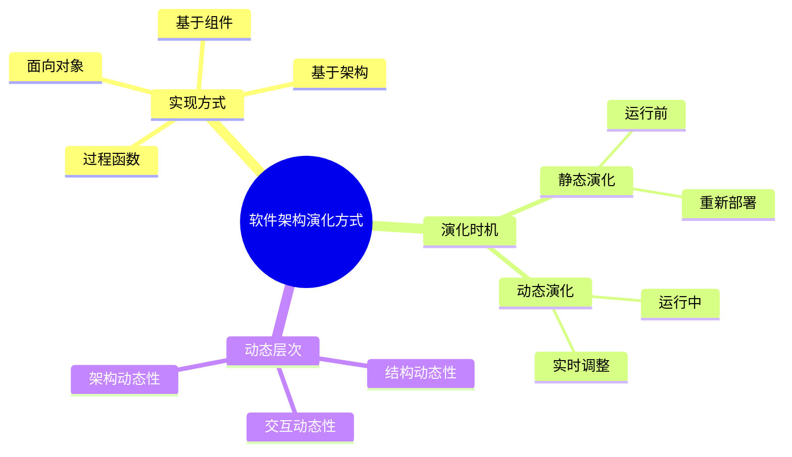

# 03 Software Architecture Evolution Methods（软件架构演化方式）

> 本文依据《15.软件架构的演化和维护.pdf》整理，用于系统架构设计师考试复习。主要介绍软件架构演化方式的分类，包括基于过程和函数的演化、面向对象演化、基于组件演化、基于架构演化，以及静态演化和动态演化。

---

# 目录

1. 软件架构演化方式概述
2. 按实现方式和实施粒度分类
3. 基于过程和函数的演化
4. 面向对象软件架构演化
5. 基于组件的软件架构演化
6. 基于架构的软件架构演化
7. 按演化时机分类
8. 静态演化
9. 动态演化
10. 高频考点
11. 易错点
12. Mermaid 思维导图
13. 本节小结

---

# 1. 软件架构演化方式概述

软件架构演化可以根据不同角度进行分类。

常见分类方式：

## 按实现方式和实施粒度分类

包括：

- 基于过程和函数的演化；
- 面向对象的软件架构演化；
- 基于组件的软件架构演化；
- 基于架构的软件架构演化。

## 按演化时机分类

包括：

- 静态演化；
- 动态演化。

---

# 2. 按实现方式和实施粒度分类

## 2.1 基于过程和函数的演化

早期软件系统通常采用过程化设计方法。

架构演化主要围绕：

- 函数调整；
- 过程调用关系变化；
- 数据处理流程变化。

特点：

- 以功能过程为核心；
- 演化粒度较小；
- 修改可能影响较多调用关系。

---

# 3. 面向对象软件架构演化

面向对象演化主要关注：

- 对象；
- 类；
- 消息交互；
- UML模型元素。

常见演化方式：

## 对象演化

包括：

- AO（Add Object）
- DO（Delete Object）

## 消息演化

包括：

- AM（Add Message）
- DM（Delete Message）
- SMO（Swap Message Order）
- OM（Overturn Message）
- CMM（Change Message Module）

## 模型元素演化

包括：

- 复合片段演化；
- 约束演化。

---

# 4. 基于组件的软件架构演化

基于组件的软件架构演化主要围绕组件进行调整。

主要操作：

- 增加组件；
- 删除组件；
- 修改组件接口；
- 调整组件连接关系。

特点：

- 以组件作为基本演化单元；
- 提高系统复用能力；
- 降低修改影响范围。

---

# 5. 基于架构的软件架构演化

基于架构的演化关注系统整体结构变化。

主要涉及：

- 架构元素变化；
- 元素之间关系变化；
- 架构约束变化；
- 质量属性变化。

特点：

- 演化粒度更高；
- 影响范围更大；
- 需要进行架构评估。

---

# 6. 按演化时机分类

软件架构演化还可以按照发生时间分为：

- 静态演化；
- 动态演化。

---

# 7. 静态演化

静态演化是指：

> 在系统运行之前完成的软件架构调整。

特点：

- 通常发生在设计阶段；
- 修改完成后重新部署系统；
- 可能需要停止服务。

优点：

- 实现简单；
- 风险较容易控制。

缺点：

- 不适合需要持续运行的系统。

---

# 8. 动态演化

动态演化是指：

> 在系统运行过程中进行的软件架构调整。

特点：

- 不需要停止系统；
- 可以实时响应变化；
- 对系统运行能力要求较高。

动态演化主要原因：

## 系统内部执行需求变化

例如：

- 增加组件；
- 调整服务。

## 系统外部请求变化

例如：

- 配置变化；
- 服务需求变化。

---

# 9. 动态演化层次

动态演化可以分为：

## 9.1 交互动态性

关注：

- 数据结构变化；
- 交互方式变化。

---

## 9.2 结构动态性

关注：

- 组件变化；
- 连接件变化。

---

## 9.3 架构动态性

关注：

- 整体架构调整。

---

# 10. 演化方式总结

| 分类方式 | 类型 |
|---|---|
| 按实现方式 | 过程函数演化 |
| 按实现方式 | 面向对象演化 |
| 按实现方式 | 基于组件演化 |
| 按实现方式 | 基于架构演化 |
| 按时间 | 静态演化 |
| 按时间 | 动态演化 |

---

# 11. 高频考点（★★★★★）

重点掌握：

1. 软件架构演化分类方法；
2. 四种实现方式区别；
3. 静态演化特点；
4. 动态演化特点；
5. 动态演化三个层次。

---

# 12. 易错点

| 易错知识 | 正确理解 |
|---|---|
| 动态演化发生在设计阶段 | 动态演化发生在运行阶段 |
| 静态演化一定不需要重新部署 | 静态演化通常需要重新部署 |
| 组件演化只修改代码 | 组件演化涉及组件和连接关系 |
| 架构演化粒度最低 | 架构演化粒度最高 |

---

# 13. Mermaid 思维导图

---

# 14. 本节小结

软件架构演化方式体现了系统从简单修改到架构级调整的发展过程。

本节重点：

- 掌握架构演化分类；
- 理解不同演化方式适用场景；
- 掌握静态演化和动态演化区别；
- 理解动态演化三个层次。

后续章节将继续学习软件架构演化原则。
