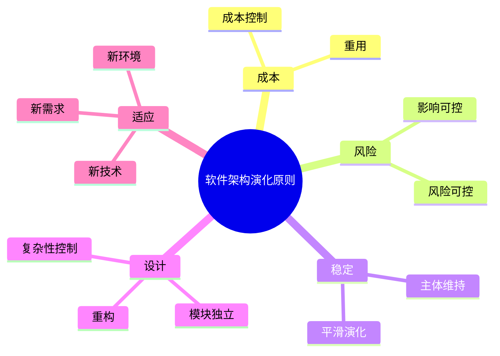

# 04 Software Architecture Evolution Principles（软件架构演化原则）

> 本文依据《15.软件架构的演化和维护.pdf》整理，用于系统架构设计师考试复习。主要介绍软件架构演化过程中的基本原则，包括成本控制、风险控制、平滑演化、模块独立演化、重构与重用等原则。

---

# 目录

1. 软件架构演化原则概述
2. 演化成本控制原则
3. 进度可控原则
4. 风险可控原则
5. 主体维持原则
6. 系统总体结构优化原则
7. 平滑演化原则
8. 目标一致原则
9. 模块独立演化原则
10. 影响可控原则
11. 复杂性可控原则
12. 重构与重用原则
13. 其他演化原则
14. 高频考点
15. 易错点
16. Mermaid 思维导图
17. 本节小结

---

# 1. 软件架构演化原则概述

软件架构演化过程中，需要遵循一定原则，保证系统在变化过程中：

- 保持稳定性；
- 控制修改成本；
- 降低演化风险；
- 保证系统质量。

架构演化不是简单增加功能，而是在满足新需求的同时保持系统整体结构合理。

---

# 2. 演化成本控制原则

含义：

软件架构演化应控制修改成本。

主要措施：

- 提前规划架构变化；
- 降低模块之间耦合；
- 提高组件复用能力。

目标：

降低长期维护成本。

---

# 3. 进度可控原则

含义：

架构演化过程需要保证开发进度可管理。

要求：

- 制定合理演化计划；
- 明确演化阶段；
- 控制任务范围。

---

# 4. 风险可控原则

含义：

架构演化过程中需要识别和控制风险。

风险包括：

- 技术风险；
- 性能风险；
- 兼容性风险；
- 数据风险。

措施：

- 提前评估影响；
- 分阶段实施；
- 保留回退方案。

---

# 5. 主体维持原则

含义：

架构演化过程中，应保持系统主体结构稳定。

目的：

避免大规模破坏已有架构。

---

# 6. 系统总体结构优化原则

含义：

演化过程中不仅满足当前需求，还需要优化系统整体结构。

关注：

- 架构合理性；
- 扩展能力；
- 可维护性。

---

# 7. 平滑演化原则

含义：

系统架构变化应该逐步进行。

特点：

- 避免一次性大规模修改；
- 降低系统切换风险；
- 保证业务连续性。

---

# 8. 目标一致原则

含义：

架构演化方向应与系统目标保持一致。

要求：

- 演化目标明确；
- 技术选择符合业务需求。

---

# 9. 模块独立演化原则

含义：

模块之间应尽可能独立，使单个模块可以独立变化。

实现方式：

- 降低耦合；
- 提高内聚；
- 使用接口隔离。

优点：

- 减少修改影响范围；
- 提高维护效率。

---

# 10. 影响可控原则

含义：

架构修改产生的影响应能够预测和控制。

措施：

- 分析依赖关系；
- 控制影响范围；
- 进行演化评估。

---

# 11. 复杂性可控原则

含义：

演化过程中避免系统复杂度不断增加。

措施：

- 定期重构；
- 删除无用结构；
- 优化架构设计。

---

# 12. 重构与重用原则

## 12.1 有利于重构原则

架构演化应支持：

- 代码重构；
- 模块调整；
- 架构优化。

---

## 12.2 有利于重用原则

架构设计应提高：

- 组件复用；
- 服务复用；
- 模块复用。

---

# 13. 其他演化原则

软件架构演化还需要考虑：

## 设计原则遵从性原则

保持架构设计规范。

## 适应新技术原则

支持技术发展。

## 环境适应性原则

适应运行环境变化。

## 标准从优原则

优先采用成熟标准。

## 质量向好原则

持续提升系统质量。

## 适应新需求原则

支持业务变化。

---

# 14. 软件架构演化原则总结

| 原则 | 目标 |
|---|---|
| 成本控制 | 降低演化成本 |
| 进度可控 | 保证实施计划 |
| 风险可控 | 降低演化风险 |
| 主体维持 | 保持系统稳定 |
| 平滑演化 | 降低切换影响 |
| 模块独立 | 降低耦合 |
| 影响可控 | 控制修改范围 |
| 复杂性可控 | 防止系统恶化 |
| 重构重用 | 提高维护能力 |

---

# 15. 高频考点（★★★★★）

重点掌握：

1. 软件架构演化为什么需要原则；
2. 成本控制原则；
3. 风险可控原则；
4. 平滑演化原则；
5. 模块独立演化原则；
6. 影响可控原则；
7. 复杂性控制原则。

---

# 16. 易错点

| 易错知识 | 正确理解 |
|---|---|
| 演化就是不断增加功能 | 演化还包括优化和调整 |
| 修改越大越好 | 应控制影响范围 |
| 模块越集中越容易演化 | 独立模块更容易演化 |
| 演化不需要风险分析 | 演化必须控制风险 |

---

# 17. Mermaid 思维导图

---

# 18. 本节小结

软件架构演化原则用于指导系统在变化过程中保持稳定和可维护。

本节重点：

- 理解架构演化原则的作用；
- 掌握主要原则含义；
- 能够根据实际场景选择合适的演化策略。

后续章节将继续学习软件架构演化评估。
