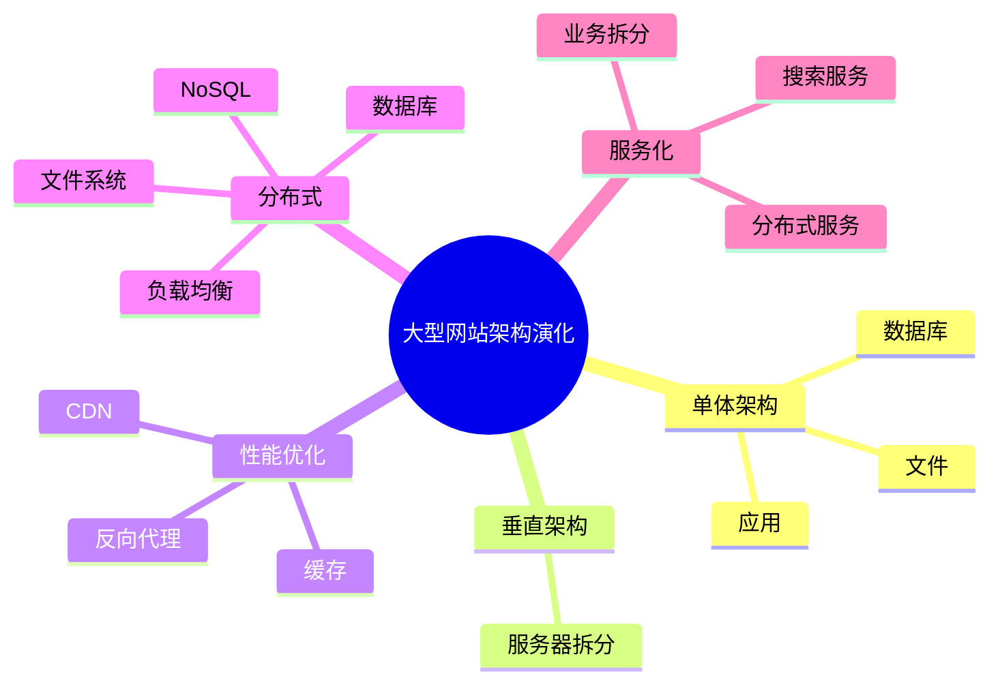

# 06 Large Scale Website Architecture Evolution（大型网站架构演化）

> 本文依据《15.软件架构的演化和维护.pdf》整理，用于系统架构设计师考试复习。主要介绍大型网站架构从单体架构到分布式服务架构的发展过程，以及各阶段解决的问题。

---

# 目录

1. 大型网站架构演化概述
2. 单体架构阶段
3. 垂直架构阶段
4. 使用缓存和 CDN
5. 反向代理和负载均衡
6. 分布式文件系统
7. 分布式数据库
8. NoSQL 数据库
9. 搜索引擎服务
10. 业务拆分
11. 分布式服务架构
12. 架构演化总结
13. 高频考点
14. 易错点
15. Mermaid 思维导图
16. 本节小结

---

# 1. 大型网站架构演化概述

随着互联网业务的发展，大型网站面临：

- 用户规模不断增长；
- 访问压力不断增加；
- 数据规模快速扩大；
- 业务功能持续增加。

早期简单架构无法满足发展需求，因此网站架构需要不断演化。

典型演化过程：

```text
单体架构

↓

垂直架构

↓

缓存/CDN

↓

反向代理

↓

负载均衡

↓

分布式文件系统

↓

分布式数据库

↓

NoSQL

↓

搜索服务

↓

业务拆分

↓

分布式服务架构
```

---

# 2. 单体架构阶段

单体架构是大型网站最初阶段的典型形式。

结构：

```text
应用程序

↓

文件

↓

数据库
```

特点：

优点：

- 开发简单；
- 部署方便；
- 维护成本低。

缺点：

- 扩展能力有限；
- 单点压力集中；
- 修改影响范围大。

适用于：

- 用户量较小；
- 业务简单的系统。

---

# 3. 垂直架构阶段

随着业务增长，单体架构逐渐拆分。

结构：

```text
应用服务器

↓

文件服务器

↓

数据库服务器
```

主要思想：

将不同功能部署到不同服务器。

优点：

- 降低单机压力；
- 提高系统处理能力；
- 便于扩展。

缺点：

- 仍然存在业务耦合。

---

# 4. 使用缓存和 CDN

为提高访问速度，引入缓存技术。

## 缓存

作用：

- 减少数据库访问；
- 提高响应速度；
- 降低服务器压力。

缓存位置：

- 页面缓存；
- 数据缓存；
- 本地缓存。

---

## CDN

CDN（内容分发网络）：

作用：

将静态资源分布到多个节点。

优点：

- 提高访问速度；
- 降低源站压力。

---

# 5. 反向代理和负载均衡

## 反向代理

作用：

客户端请求先到代理服务器，再转发给后端服务器。

结构：

```text
用户

↓

反向代理

↓

应用服务器
```

---

## 负载均衡

作用：

将请求分配到多个服务器。

结构：

```text
用户请求

↓

负载均衡

↓

服务器1
服务器2
服务器N
```

优点：

- 提高并发能力；
- 提升系统可用性；
- 支持水平扩展。

---

# 6. 分布式文件系统

随着数据规模增加，单机文件存储无法满足需求。

分布式文件系统特点：

- 多节点存储；
- 文件统一管理；
- 提高存储能力。

解决：

- 海量文件存储问题。

---

# 7. 分布式数据库

传统数据库单机能力有限，需要扩展。

分布式数据库特点：

- 数据分布存储；
- 支持水平扩展；
- 提高处理能力。

解决：

- 大规模数据访问问题。

---

# 8. NoSQL 数据库

当数据规模和访问模式进一步变化，引入 NoSQL。

特点：

- 非关系型数据存储；
- 高扩展性；
- 高并发访问能力。

适用于：

- 海量数据；
- 高并发场景。

---

# 9. 搜索引擎服务

大型网站通常需要独立搜索服务。

作用：

- 提供快速检索；
- 减少数据库查询压力。

特点：

- 建立索引；
- 支持全文搜索。

---

# 10. 业务拆分

随着业务复杂度增加，将系统拆分为多个业务模块。

例如：

```text
用户服务

订单服务

支付服务

商品服务
```

优点：

- 降低系统复杂度；
- 提高独立扩展能力；
- 便于团队维护。

---

# 11. 分布式服务架构

最终大型网站通常演化为分布式服务架构。

特点：

- 服务独立部署；
- 服务之间通过接口通信；
- 支持弹性扩展。

典型结构：

```text
客户端

↓

网关

↓

业务服务

↓

基础服务

↓

数据存储
```

---

# 12. 架构演化总结

| 阶段 | 解决问题 |
|---|---|
| 单体架构 | 快速开发 |
| 垂直架构 | 分散服务器压力 |
| 缓存/CDN | 提高访问速度 |
| 反向代理 | 请求转发 |
| 负载均衡 | 提高并发 |
| 分布式存储 | 海量数据 |
| NoSQL | 高并发数据访问 |
| 搜索服务 | 快速检索 |
| 业务拆分 | 降低复杂度 |
| 分布式服务 | 支撑大型系统 |

---

# 13. 高频考点（★★★★★）

重点掌握：

1. 大型网站架构演化过程；
2. 单体架构特点；
3. 垂直架构作用；
4. CDN 和缓存作用；
5. 负载均衡作用；
6. 分布式存储意义；
7. 业务拆分原因；
8. 分布式服务架构特点。

---

# 14. 易错点

| 易错知识 | 正确理解 |
|---|---|
| 架构演化一次完成 | 大型系统通常逐步演化 |
| CDN解决数据库问题 | CDN主要解决静态资源访问问题 |
| 负载均衡等于分布式服务 | 负载均衡只是扩展方式之一 |
| 业务拆分只是代码拆分 | 同时涉及部署和架构调整 |

---

# 15. Mermaid 思维导图



---

# 16. 本节小结

大型网站架构演化体现了软件架构不断适应业务增长的过程。

考试重点：

- 掌握各阶段出现的原因；
- 理解每种技术解决的问题；
- 能够根据场景选择合适架构方案。

后续章节将继续学习软件架构维护。
